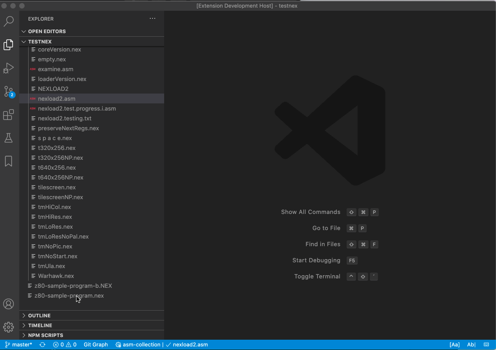
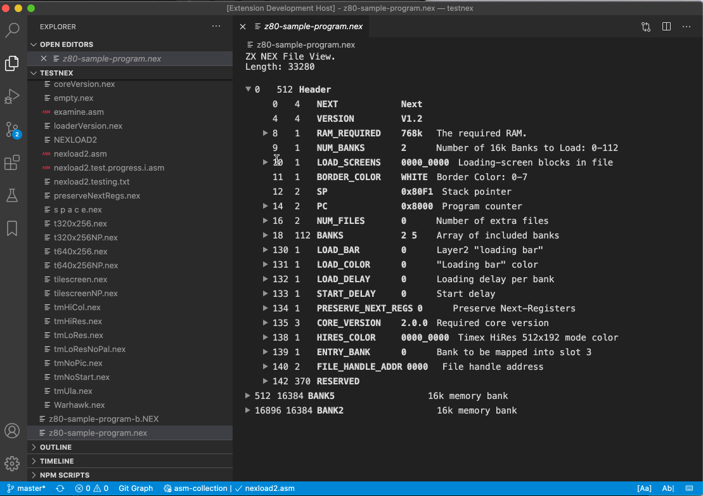

# Support

If you like the "ZX NEX File Viewer" please consider supporting it.

&nbsp;&nbsp;

# ZX NEX File Viewer

This extension adds a readonly file viewer for ZX Spectrum NEX files.
.nex is a special file format for loading ZX Next programs.
The viewer shows registers, a memory dump and the included screen images.

The NEX file format specification can be found [here](https://wiki.specnext.dev/NEX_file_format).

## Installation

Install through Visual Studio Code Marketplace.
The extension is called "ZX NEX File Viewer".

# Usage

Just click on a file with the *.nex extension.
The file is opened and shown in the text editor area.

Alternatively you can open a NEX file via "Open With...":

When hovering over a value you can get additional info like the offset or the value in decimal:

